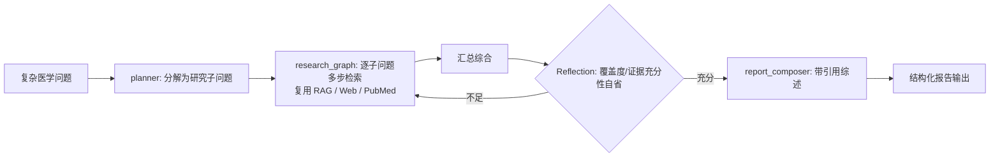

# Agent 技术现代化 & 能力扩展蓝图

> 本项目核心是 **Agent 开发**。本文档系统梳理引入的最新 agent 工程实践（主线二）与新增的承载最新范式的功能/新 Agent（主线三），每项含：现状差距、目标设计、与现有代码映射、落地阶段、降级策略。
>
> 配套文档：[`ENTERPRISE_ARCHITECTURE.md`](./ENTERPRISE_ARCHITECTURE.md)（规模化基座）。

---

## 主线二：Agent 技术现代化

### 现状概览

当前编排（`agents/agent_decision.py`）是**单层 LLM-JSON 路由 supervisor**：

- 路由用 `ChatPromptTemplate | LLM | JsonOutputParser`（脆弱，依赖 LLM 稳定吐 JSON）+ confidence 阈值。
- Human-in-the-loop 靠字符串匹配 `"Human Validation Required"` + **重跑 `process_query` 模拟**。
- RAG 有 query 扩展/重排 + "低置信转 web" 雏形，但**无文档相关性打分、无生成后自省**。
- 无流式、无 MCP、无长期记忆、无 agent 评估/追踪、agent 间无协作。

### 现代化技术地图

| # | 技术 | 现状差距 | 目标 | 阶段 |
|---|------|---------|------|------|
| 1 | **结构化 / Tool-Calling 路由** | `JsonOutputParser` 字符串解析，易失败 | `LLM.with_structured_output(Pydantic)`，稳健；后续 `Command` handoff 支持 agent 协作 | **P1** |
| 2 | **Agentic RAG（CRAG / Self-RAG）** | 无文档 grading、无自省 | 检索后文档相关性打分 → 不相关则改写/转 web；生成后幻觉 + 答案自省 | **P1** |
| 3 | **原生 Human-in-the-Loop** | 字符串匹配 + 重跑模拟 | LangGraph `interrupt()` + checkpointer 真正暂停/恢复 | **P1** |
| 4 | **流式响应** | 同步一次性返回 | `astream_events` + SSE，token/step 级推送 | **P1** |
| 5 | **MCP 工具标准化** | 工具硬编码 | `langchain-mcp-adapters` 把 PubMed/Tavily/影像/检索封装为标准工具 | P2–P3 |
| 6 | **长短期记忆** | 仅会话内内存 | 短期=checkpointer；长期=LangGraph `Store`/LangMem 跨会话语义记忆 | P3 |
| 7 | **Reflection 自省** | 无 | 医疗输出生成后自我审查（Reflexion） | P1（RAG 内）→ 全局 P3 |
| 8 | **LangSmith 追踪 + 评估** | 无（依赖已含 `langsmith`） | 全链路追踪 + RAGAS（faithfulness/answer relevancy/路由准确率/诊断 correctness） | P4 |
| 9 | **Guardrails 强化** | 基础输入/输出检查 | 提示注入检测 + 输出医疗事实/幻觉核查（LLM-as-judge） | P3 |
| 10 | **推理模型可插拔** | 固定 chat 模型 | 高风险路由/诊断切换推理型模型（qwen-qwq / deepseek-r1 类） | P4 |
| 11 | **多智能体协作** | 仅路由分发 | Supervisor handoff + 高风险诊断 ensemble/debate 投票 | P5 |

### P1 落地设计细节

**1. 结构化路由**
```python
# agents/agent_decision.py
from pydantic import BaseModel, Field
class AgentDecision(BaseModel):
    agent: str = Field(description="目标专家 agent 名称")
    reasoning: str = Field(description="路由推理")
    confidence: float = Field(ge=0.0, le=1.0)

router = decision_model.with_structured_output(AgentDecision)
# 失败降级：捕获异常回退到原 JsonOutputParser 链或默认 CONVERSATION_AGENT
```

**2. 原生 HITL**
- 诊断类 agent（`require_validation=True`）节点后调用 `interrupt({...})` 暂停图执行；
- `/validate` 端点用 `graph.invoke(Command(resume=decision), thread_config)` 恢复，替代重跑；
- 依赖外部 checkpointer 持久化中断点（与会话隔离同一基础设施）。

**3. Agentic RAG (CRAG)**
```
retrieve → grade_documents(相关性打分)
         ├─ 相关 → generate → grade_hallucination + grade_answer(自省) → [必要时重试/补检]
         └─ 不相关 → transform_query(改写) 或 route_to_web_search
```
- 复用现有 `query_expander` / `reranker`；新增 `grader.py`（LLM-as-judge，结构化输出）；
- 全部由开关控制，任一环节失败降级为原始 RAG 行为。

---

## 主线三：能力扩展（新功能 / 新 Agent）

用新增能力承载现有架构装不下的最新 agent 范式。

| 新能力 | 承载的最新范式 | 阶段 |
|--------|--------------|------|
| **Medical Deep Research Agent** | Plan-and-Execute + Reflection / Orchestrator-Worker | **P1** |
| 多模态诊断 Agent | Multi-modal Agent（影像+文本+病史融合） | P3 |
| 临床计算 / 用药 Agent | Code-Interpreter / Tool-Use（sandbox 执行剂量/量表/药物相互作用） | P3 |
| 自建 MCP Server | MCP 工具互操作，供内外部 agent 复用 | P2 |
| 长期记忆服务 | 跨会话语义记忆（患者档案/偏好） | P3 |
| GraphRAG 医学知识图谱 | 实体关系增强检索 | P4 |
| 多智能体 ensemble 诊断 | Multi-Agent 协作 / debate 投票 | P5 |
| Agent 评估回归框架 | Agent Evaluation（LangSmith datasets + RAGAS） | P4 |

### P1 落地：Medical Deep Research Agent

**定位**：面向复杂医学问题（如"某疾病最新诊疗进展综述"），自动做多步研究并产出**带文献引用**的结构化报告。

**内部结构**（`agents/deep_research_agent/`，独立 LangGraph 子图）：


**接入方式**：
- 作为 `agent_decision.py` 主图的**新节点 + 新路由目标** `DEEP_RESEARCH_AGENT`；
- 复用现有 `rag_agent` 与 `web_search_processor_agent` 工具，**不改动存量 agent 行为**；
- 通过 `config` 开关 `enable_deep_research` 控制，默认可关闭，失败降级为普通 RAG/Web 回答。

**降级/安全**：
- 子问题数量与检索轮次设上限，避免无限循环与成本失控；
- 诊断类结论仍走 human validation；
- 依赖的检索工具不可用时逐项跳过并在报告中标注。

---

## 降级与兼容原则（贯穿全部改造）

1. **开关化**：Redis / 结构化输出 / CRAG 自省 / 流式 / Deep Research 均可独立开关。
2. **优雅降级**：任一现代能力不可用时回退到原行为，保证 Windows 本地 `conda medical-assistant` 环境可导入运行。
3. **不回归**：文本对话、RAG、Web 搜索、三类影像分析、语音、guardrails、人工验证的既有行为保持可用。
4. **可灰度**：新能力先以旁路/可选路由存在，验证稳定后再作为默认。
