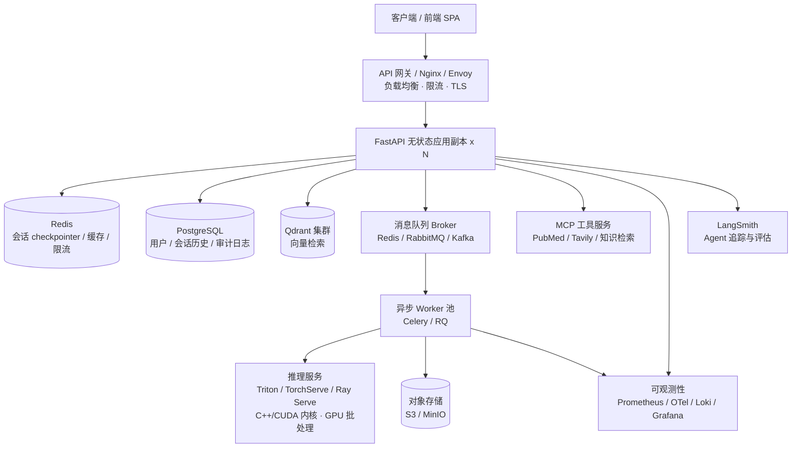

# 企业级医疗智能平台 —— 规模化架构蓝图

> 本文档描述将 Multi-Agent Medical Assistant 从单机原型演进为**支撑数千+并发**的企业级医疗智能平台的目标架构、技术选型、数据流、医疗合规要点与分阶段演进路线图（P1–P5）。
>
> 配套文档：[`AGENT_MODERNIZATION.md`](./AGENT_MODERNIZATION.md)（Agent 技术现代化与能力扩展）。

---

## 1. 现状与目标差距

当前项目是一个功能完整但**单机、单进程、内存态**的原型：

| 维度 | 现状 | 企业级目标 |
|------|------|-----------|
| 部署 | `uvicorn.run(app)` 单进程 | 多进程 + 多副本 + 水平扩展（K8s HPA） |
| 会话状态 | `MemorySaver()` 内存 + `thread_id="1"` 硬编码 | Redis/PG 外部 checkpointer，跨副本共享、会话隔离 |
| 端点 | 同步 `def`，阻塞事件循环 | `async` + 线程池/服务化，非阻塞 |
| 模型推理 | 进程内 PyTorch（CPU，GIL 瓶颈） | 独立推理服务（Triton/TorchServe，GPU 批处理） |
| 存储 | 本地磁盘 uploads / Qdrant local | 对象存储 + Qdrant 集群 |
| 认证 | 无 | JWT/OAuth2 + RBAC |
| 合规 | 无审计、无脱敏 | 加密、PII 脱敏、审计留痕 |
| 可观测性 | print/logging | 指标 + 日志 + 链路追踪 + 告警 |
| 交付 | 手动 | CI/CD 自动化 |

---

## 2. 目标架构

### 分层职责

1. **接入层（网关）**：Nginx/Envoy 负责 TLS 终结、负载均衡、限流、SSE 长连接透传（`proxy_buffering off`）。
2. **应用层（无状态）**：FastAPI 多副本，只做请求编排与 agent 调度，**不保存任何本地状态**，可任意水平扩展。
3. **状态层**：Redis（会话/缓存/限流）、PostgreSQL（用户/历史/审计）、Qdrant（向量）、对象存储（影像/结果文件）。
4. **异步计算层**：消息队列 + Worker，将 GPU 影像推理、RAG 文档摄取等重任务从请求链路解耦。
5. **推理服务层**：独立模型服务，绕过 Python GIL，支持批处理与 GPU 复用。
6. **可观测层**：指标、日志、链路追踪、Agent 专用追踪与评估。

---

## 3. 编程语言与并发策略

> **结论：主体保持 Python，多语言按分层搭配；语言不是瓶颈，架构才是。**

- **为什么主体必须是 Python**：现代 agent 生态（LangGraph / LangChain / MCP / LangMem / RAGAS / PyTorch）几乎完全锁定 Python，换语言等于放弃生态，负收益。
- **Python 能否扛数千并发**：能。本平台约 90% 负载为 **I/O 密集**（等待 LLM / 检索 / 网络），`async` 协程几乎不受 GIL 影响，配合多 worker + 多副本可支撑数千并发。
- **GIL 真正的痛点**：只有 **CPU 密集的模型推理**（PyTorch 影像/重排）。解决方式是**服务化解耦**而非换语言：
  - 剥离到 **NVIDIA Triton / TorchServe / Ray Serve**（底层 C++/CUDA，天然绕过 GIL，支持动态批处理与 GPU 复用）；
  - 部署接口仍是 Python，agent 代码零改动。
- **可选多语言搭配**：
  - 网关：Nginx/Envoy（必要）；超高并发长连接可选 **Go** 写 BFF/网关（非必须）。
  - 性能敏感底层：Rust（`tokenizers`/`fastembed` 已在使用）。
  - 前端：独立 **TypeScript + React/Vue** SPA（可选，与后端解耦）。

---

## 4. 医疗数据合规要点

医疗场景需满足数据安全与合规（对标 HIPAA / 国内等保 / 数据安全法）：

1. **传输与存储加密**：全链路 TLS；数据库与对象存储静态加密（AES-256）；密钥用 KMS/Secret 管理。
2. **PII 脱敏**：日志与追踪中对患者姓名、身份证、联系方式等做脱敏；LLM 上送前可选做实体脱敏。
3. **审计留痕**：所有诊断类操作（谁、何时、对哪条数据、做了什么、人工验证结果）写入不可篡改的审计日志（PostgreSQL + 追加写）。
4. **人工验证闭环**：诊断类 AI 输出（脑肿瘤/胸片/皮肤）必须经医生 human-in-the-loop 确认后方可采信（见 `AGENT_MODERNIZATION.md` 原生 HITL）。
5. **访问控制**：JWT/OAuth2 认证 + RBAC 授权（患者/医生/管理员分级），最小权限原则。
6. **数据留存与删除**：会话/影像按策略过期清理；支持数据主体删除请求。
7. **可解释性**：保留 agent 决策 reasoning 与检索来源，支持诊断依据回溯。

---

## 5. 分阶段演进路线图

### P1 — 致命修复与现代化地基（本次落地）
- 会话隔离（动态 `thread_id` + Redis 外部 checkpointer，含内存回退）
- 端点异步化（`async` + `run_in_threadpool`）
- 多进程/多副本部署（gunicorn + UvicornWorker + docker-compose + nginx）
- 并发文件安全（影像输出唯一路径）
- 配置外部化（`debug` 默认关闭，连接走环境变量）
- Agent 现代化首批：结构化路由、原生 `interrupt()` HITL、SSE 流式、Agentic RAG(CRAG)
- 能力扩展首批：Medical Deep Research Agent

**验收**：多用户并发不串话；多 worker 正常启动；慢推理不阻塞；现有功能无回归。

### P2 — 异步计算与缓存
- 引入消息队列 + Worker（Celery/RQ），影像推理与 RAG 摄取异步化
- Redis 缓存（LLM 响应/检索结果）+ 分布式限流（替换 `config.rate_limit` 空实现）
- 对象存储（MinIO/S3）接管 uploads 与分割结果

**验收**：推理任务不占用 API 连接；重复查询命中缓存；限流生效。

### P3 — 安全与合规
- JWT/OAuth2 认证 + RBAC 授权
- 数据加密、PII 脱敏、审计日志落库（PostgreSQL）
- 用户/会话/对话历史持久化

**验收**：未授权访问被拒；审计可查；敏感信息脱敏。

### P4 — 可观测性与 CI/CD
- Prometheus 指标 + OpenTelemetry 链路 + 结构化日志（Loki）+ Grafana 面板 + 告警
- LangSmith agent 追踪 + RAGAS 评估集
- CI/CD 流水线（lint/test/build/部署）+ 自动化测试

**验收**：核心链路可观测；回归测试自动执行；一键部署。

### P5 — 云原生弹性扩展
- Kubernetes 编排：Deployment/Service/Ingress、ConfigMap/Secret、HPA 自动扩缩容
- 推理服务化（Triton/TorchServe）+ GPU 节点池
- 多副本滚动发布、健康探针、灰度

**验收**：按负载自动扩缩容；滚动发布不中断；推理 GPU 利用率提升。

---

## 6. 技术选型汇总

| 领域 | 选型 | 理由 |
|------|------|------|
| Web 框架 | FastAPI + Uvicorn/Gunicorn | 现状、async 原生、生态成熟 |
| Agent 编排 | LangGraph + LangChain | 现状、图式编排、原生 HITL/checkpointer |
| 会话/缓存 | Redis | 高性能、checkpointer/缓存/限流三用 |
| 关系库 | PostgreSQL | 事务、审计、JSONB 灵活 |
| 向量库 | Qdrant（集群） | 现状、支持 hybrid 检索 |
| 对象存储 | MinIO / S3 | 影像与结果文件 |
| 队列 | Celery/RQ + Redis（起步）→ RabbitMQ/Kafka | 异步解耦，平滑升级 |
| 推理服务 | Triton / TorchServe / Ray Serve | GPU 批处理、绕过 GIL |
| 认证 | python-jose + passlib（JWT/OAuth2） | 标准、轻量 |
| 可观测 | Prometheus + OpenTelemetry + Grafana + LangSmith | 指标/链路/agent 三层可观测 |
| 编排 | Kubernetes | 弹性扩缩容、标准化运维 |
